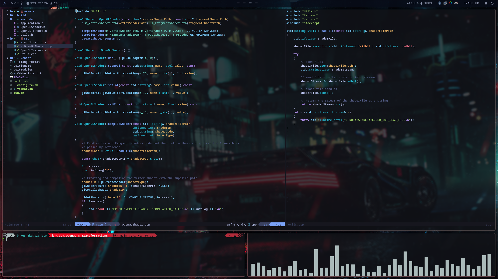

# .dotfiles
My dotfile configurations for my Linux desktop

## Hyprland



For the Hyprland config you are going to need to download the following packages:
```
yay -Sy wofi waybar-hyprland wlogout swww xdg-desktop-portal-hyprland-git network-manager-applet grim swappy polkit-gnome slurp pavucontrol pamixer swaylock-effects ttf-jetbrains-mono-nerd xfce4-settings lxappearance thunar btop pywal-git
```

You can also run the `.config/hypr/scripts/toggle-theme-loop.sh` script that cycles all over the wallpapers in the `.wallpaper` directory and set the active wallpaper to the selected one for `x` amount of time.
Pywal is also used to change your main color palette to match your current wallpaper color theme. It will only work in Wayland though since its uses `swww` to change the wallpaper, you will need to adapt it for Xorg.

## Neovim
The Neovim config are using Packer as a package manager, so make sure you have it install.


